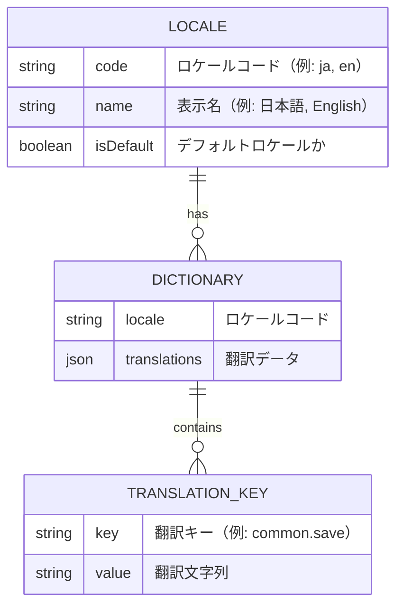

# 基本設計書

## 1. システム概要

### 1.1 目的

週単位家計簿アプリケーションに多言語対応機能を追加し、将来的に複数の言語をサポートできる基盤を整備します。外部ライブラリに依存せず、Next.js App Routerの標準機能のみを使用して実装します。

### 1.2 対象範囲

- 多言語対応の基盤構築（翻訳ファイル管理、翻訳関数、ロケール切り替え）
- 既存のハードコードされた日本語文字列の翻訳キー化
- 日付・数値・通貨のロケール対応フォーマット
- 型安全性の確保（TypeScript型定義）

### 1.3 対象外

- 実際の英語・中国語などの翻訳作成（基盤のみ整備）
- ユーザーによる言語切り替えUI（将来の拡張として残す）
- RTL（右から左）言語のサポート

## 2. 用語集

| 用語 | 説明 |
|------|------|
| ロケール | ユーザーの言語・地域設定（例: ja, en, zh-CN） |
| 翻訳キー | 翻訳文字列を識別するための一意のキー（ドット記法、例: common.save） |
| 翻訳ファイル | 言語ごとの翻訳文字列を格納するJSONファイル |
| デフォルトロケール | システムのデフォルト言語設定（日本語: ja） |
| UI文字列 | ユーザーインターフェースに表示される文字列 |
| 翻訳関数 | 翻訳キーを受け取り、現在のロケールに対応する文字列を返す関数 |
| フォールバック | 翻訳が見つからない場合にデフォルトロケールの翻訳を使用する仕組み |

## 3. システム構成図

```mermaid
graph TB
    subgraph "ユーザー"
        User[ユーザー]
    end
    
    subgraph "Next.js App Router"
        Route[/[locale]/... ルート]
        Layout[Layout コンポーネント]
        Page[Page コンポーネント]
    end
    
    subgraph "i18n基盤"
        I18nConfig[i18n設定]
        GetDict[翻訳取得関数]
        Formatter[フォーマッター]
    end
    
    subgraph "翻訳データ"
        DictJa[dictionaries/ja.json]
        DictEn[dictionaries/en.json]
        DictFuture[dictionaries/...json]
    end
    
    subgraph "UIコンポーネント"
        Component[各種コンポーネント]
    end
    
    User -->|アクセス| Route
    Route -->|ロケール渡し| Layout
    Layout -->|ロケール渡し| Page
    Page -->|翻訳取得| GetDict
    GetDict -->|読み込み| DictJa
    GetDict -->|読み込み| DictEn
    GetDict -->|読み込み| DictFuture
    Page -->|翻訳オブジェクト渡し| Component
    Component -->|フォーマット| Formatter
    I18nConfig -.->|設定参照| Route
    I18nConfig -.->|設定参照| GetDict
```

## 4. 機能一覧

| 機能ID | 機能名 | 説明 | 要件 |
|--------|--------|------|------|
| F-01 | ロケール管理 | URLパスベースでロケールを管理 | 要件1 |
| F-02 | 翻訳ファイル管理 | JSON形式で翻訳を管理 | 要件1, 4 |
| F-03 | 翻訳取得 | ロケールに応じた翻訳を取得 | 要件1 |
| F-04 | UI文字列の翻訳キー化 | ハードコードされた文字列を翻訳キーに置換 | 要件2 |
| F-05 | 日付フォーマット | ロケールに応じた日付表示 | 要件3 |
| F-06 | 数値フォーマット | ロケールに応じた数値表示 | 要件3 |
| F-07 | 通貨フォーマット | ロケールに応じた通貨表示 | 要件3 |
| F-08 | 型安全性 | TypeScriptによる翻訳キーの型チェック | 要件5 |
| F-09 | フォールバック | 翻訳が見つからない場合のデフォルト表示 | 要件7 |

## 5. 機能詳細

### F-01: ロケール管理

**概要**: URLパスの最初のセグメントでロケールを識別し、アプリケーション全体で使用します。

**動作**:
1. ユーザーが `/ja/dashboard` にアクセス → ロケールは `ja`
2. ユーザーが `/en/dashboard` にアクセス → ロケールは `en`
3. ユーザーが `/dashboard` にアクセス → デフォルトロケール `ja` にリダイレクト

**入力**: URLパス
**出力**: ロケール文字列（例: "ja", "en"）

### F-02: 翻訳ファイル管理

**概要**: ロケールごとにJSON形式で翻訳文字列を管理します。

**ファイル構造**:
```
dictionaries/
  ├── ja.json  （日本語翻訳）
  ├── en.json  （英語翻訳 - 将来）
  └── zh-CN.json  （中国語翻訳 - 将来）
```

**翻訳ファイルの形式**:
```json
{
  "common": {
    "save": "保存",
    "cancel": "キャンセル",
    "delete": "削除"
  },
  "entry": {
    "form": {
      "amount": "金額",
      "category": "カテゴリ"
    }
  }
}
```

### F-03: 翻訳取得

**概要**: 指定されたロケールの翻訳ファイルを読み込み、翻訳オブジェクトを返します。

**動作**:
1. ロケールを受け取る（例: "ja"）
2. 対応する翻訳ファイルを読み込む（例: `dictionaries/ja.json`）
3. 翻訳オブジェクトを返す

**入力**: ロケール文字列
**出力**: 翻訳オブジェクト

### F-04: UI文字列の翻訳キー化

**概要**: 既存のハードコードされた日本語文字列を翻訳関数呼び出しに置き換えます。

**変更前**:
```tsx
<button>保存</button>
```

**変更後**:
```tsx
<button>{t.common.save}</button>
```

**対象コンポーネント**:
- すべてのUIコンポーネント（entities, features, widgets, pages）
- ボタンラベル、フォームラベル、エラーメッセージ、説明文など

### F-05: 日付フォーマット

**概要**: ロケールに応じて日付を適切な形式で表示します。

**フォーマット例**:
- 日本語（ja）: `2025/11/19`
- 英語（en）: `11/19/2025`

**使用場所**:
- 取引日の表示
- 週の開始日・終了日の表示

### F-06: 数値フォーマット

**概要**: ロケールに応じて数値を適切な形式で表示します。

**フォーマット例**:
- 日本語（ja）: `1,000`
- ドイツ語（de）: `1.000`

### F-07: 通貨フォーマット

**概要**: ロケールに応じて通貨を適切な形式で表示します。

**フォーマット例**:
- 日本語（ja）: `¥1,000`
- 英語（en）: `$1,000`

**使用場所**:
- 取引金額の表示
- 週次サマリーの合計金額表示
- カテゴリ別集計の表示

### F-08: 型安全性

**概要**: TypeScriptの型定義により、翻訳キーの使用時にコンパイルエラーで誤りを検出します。

**機能**:
- 翻訳キーの自動補完
- 存在しないキーの使用時にエラー表示
- ネストされたキーへの型安全なアクセス

### F-09: フォールバック

**概要**: 翻訳が見つからない場合、デフォルトロケール（日本語）の翻訳を表示します。

**動作**:
1. 指定されたロケールで翻訳キーを検索
2. 見つからない場合、デフォルトロケール（ja）で検索
3. それでも見つからない場合、翻訳キーをそのまま表示

## 6. 画面設計

### 6.1 画面遷移図

```mermaid
graph LR
    Root[/] -->|リダイレクト| JaRoot[/ja]
    JaRoot --> JaDashboard[/ja/dashboard]
    JaDashboard --> JaEntries[/ja/entries]
    
    EnRoot[/en] --> EnDashboard[/en/dashboard]
    EnDashboard --> EnEntries[/en/entries]
    
    style Root fill:#f9f9f9
    style JaRoot fill:#e3f2fd
    style EnRoot fill:#e3f2fd
```

**説明**:
- すべてのページURLにロケールプレフィックスが付く
- ルートパス（/）はデフォルトロケール（/ja）にリダイレクト
- 既存のページ構造は維持され、ロケールプレフィックスのみ追加

### 6.2 画面レイアウト

**変更なし**: 既存の画面レイアウトは変更しません。表示される文字列のみが翻訳キー経由で取得されるようになります。

## 7. データ構造

### 7.1 エンティティ関連図



### 7.2 翻訳データ構造

**階層構造**:
```
common/          # 共通文字列
  - save, cancel, delete, edit, add, etc.
entry/           # 取引関連
  - form/        # フォーム
  - list/        # リスト
  - detail/      # 詳細
category/        # カテゴリ関連
  - form/
  - list/
dashboard/       # ダッシュボード
  - summary/     # サマリー
  - chart/       # チャート
error/           # エラーメッセージ
validation/      # バリデーションメッセージ
```

## 8. 外部インターフェース

### 8.1 ブラウザAPI

**使用API**:
- `Intl.DateTimeFormat`: 日付のフォーマット
- `Intl.NumberFormat`: 数値・通貨のフォーマット

**使用例**:
```typescript
// 日付フォーマット
new Intl.DateTimeFormat('ja-JP').format(date)

// 通貨フォーマット
new Intl.NumberFormat('ja-JP', { 
  style: 'currency', 
  currency: 'JPY' 
}).format(amount)
```

### 8.2 ファイルシステム

**読み込み対象**:
- `dictionaries/*.json`: 翻訳ファイル

**読み込みタイミング**:
- サーバーサイドでのページレンダリング時
- ビルド時に静的に読み込み可能

## 9. 非機能要件

### 9.1 パフォーマンス

| 項目 | 要件 | 測定方法 |
|------|------|----------|
| ページ読み込み時間 | 既存と同等（増加なし） | Lighthouse スコア |
| 翻訳ファイル読み込み | 10ms以内 | サーバーログ |
| 初回レンダリング | 既存と同等 | FCP測定 |

### 9.2 保守性

- 翻訳ファイルは人間が読みやすいJSON形式
- 翻訳キーは階層的で意味が明確
- 新しいロケール追加は翻訳ファイル追加のみで可能

### 9.3 拡張性

- 新しいロケールの追加が容易
- 翻訳キーの追加が容易
- 既存コードへの影響を最小化

### 9.4 互換性

- Next.js 14+ App Router
- React 18+
- TypeScript 5+
- モダンブラウザ（Chrome, Firefox, Safari, Edge）

## 10. ユースケース一覧

### UC-01: 日本語でアプリケーションを使用する

**アクター**: 日本語ユーザー

**前提条件**: なし

**基本フロー**:
1. ユーザーがアプリケーションにアクセス
2. システムはデフォルトロケール（ja）を適用
3. すべてのUI文字列が日本語で表示される
4. 日付は `YYYY/MM/DD` 形式で表示される
5. 通貨は `¥` 記号付きで表示される

**事後条件**: ユーザーは日本語でアプリケーションを使用できる

### UC-02: 将来的に英語でアプリケーションを使用する

**アクター**: 英語ユーザー

**前提条件**: 英語翻訳ファイル（en.json）が作成されている

**基本フロー**:
1. ユーザーが `/en/dashboard` にアクセス
2. システムはロケール（en）を適用
3. すべてのUI文字列が英語で表示される
4. 日付は `MM/DD/YYYY` 形式で表示される
5. 通貨は `$` 記号付きで表示される

**事後条件**: ユーザーは英語でアプリケーションを使用できる

### UC-03: 翻訳が見つからない場合

**アクター**: 任意のユーザー

**前提条件**: 一部の翻訳キーが特定のロケールで未定義

**基本フロー**:
1. ユーザーが特定のロケールでアクセス
2. システムは翻訳キーを検索
3. 翻訳が見つからない場合、デフォルトロケール（ja）の翻訳を使用
4. デフォルトロケールにも翻訳がない場合、翻訳キーをそのまま表示

**事後条件**: ユーザーは何らかの文字列を確認できる

### UC-04: 開発者が新しい翻訳キーを追加する

**アクター**: 開発者

**前提条件**: なし

**基本フロー**:
1. 開発者が翻訳ファイル（ja.json）に新しいキーと値を追加
2. 開発者がコンポーネントで翻訳キーを使用
3. TypeScriptが型チェックを実行
4. IDEが自動補完を提供
5. アプリケーションが新しい翻訳を表示

**事後条件**: 新しい翻訳キーが使用可能になる

### UC-05: 開発者が新しいロケールを追加する

**アクター**: 開発者

**前提条件**: なし

**基本フロー**:
1. 開発者が新しい翻訳ファイル（例: zh-CN.json）を作成
2. 開発者がi18n設定に新しいロケールを追加
3. 開発者が翻訳ファイルに翻訳を記入
4. アプリケーションが新しいロケールをサポート

**事後条件**: 新しいロケールが使用可能になる

## 11. 制約事項

### 11.1 技術的制約

- Next.js App Routerの機能のみを使用（外部i18nライブラリは使用しない）
- 翻訳ファイルはJSON形式のみサポート
- ロケールはURLパスベースのみ（クッキーやヘッダーは使用しない）

### 11.2 運用上の制約

- 初期リリースでは日本語のみサポート
- 翻訳ファイルの更新にはデプロイが必要
- 動的な翻訳の追加・変更は不可

### 11.3 ビジネス上の制約

- 既存機能への影響を最小限にする
- パフォーマンスの低下を許容しない
- 既存のユーザーエクスペリエンスを維持する

## 12. 移行計画

### 12.1 移行フェーズ

**フェーズ1: 基盤構築**
- i18n設定の作成
- 翻訳ファイル構造の作成
- 翻訳取得関数の実装
- フォーマッター関数の実装

**フェーズ2: 既存コードの移行**
- shared層のコンポーネント移行
- entities層のコンポーネント移行
- features層のコンポーネント移行
- widgets層のコンポーネント移行
- pages層のコンポーネント移行

**フェーズ3: テストと検証**
- 既存テストの更新
- 新規テストの追加
- 手動テスト
- パフォーマンステスト

### 12.2 ロールバック計画

万が一問題が発生した場合:
1. 以前のバージョンにロールバック
2. 問題を修正
3. 再度デプロイ

## 13. 参考資料

- [App RouterでライブラリなしでI18n対応する](https://zenn.dev/progate/articles/app-router-i18n-without-library)
- [Next.js Internationalization](https://nextjs.org/docs/app/building-your-application/routing/internationalization)
- [MDN: Intl](https://developer.mozilla.org/ja/docs/Web/JavaScript/Reference/Global_Objects/Intl)
