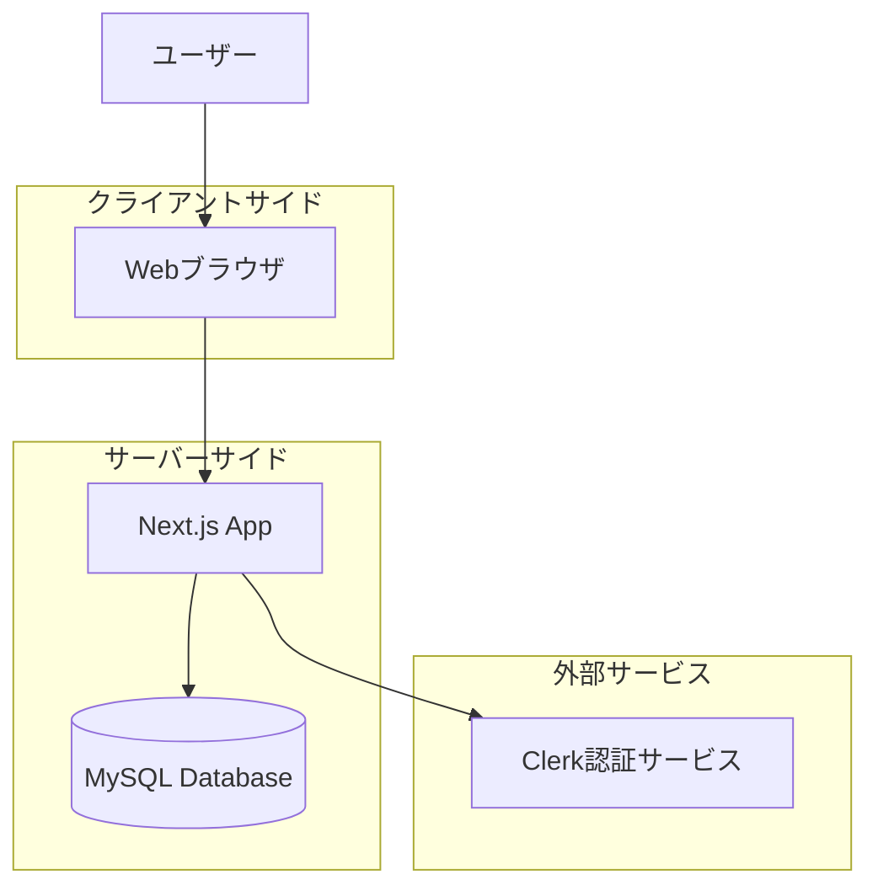
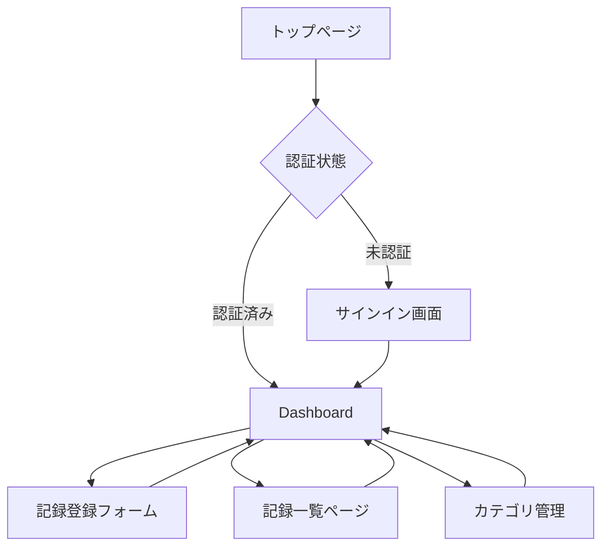
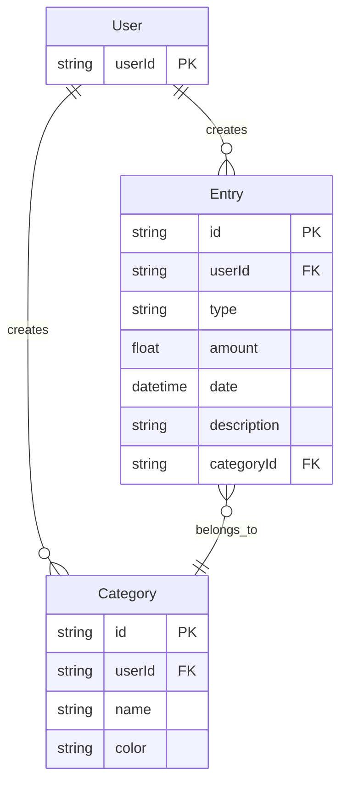

# 基本設計書（外部設計）

## 1. システム概要

### 1.1 システム名
週単位家計簿アプリ

### 1.2 目的
ユーザーが収入と支出を記録し、週単位で家計を管理できるWebアプリケーションを提供する。

### 1.3 対象ユーザー
個人の家計管理を行いたいユーザー

### 1.4 システムの特徴
- 週単位での家計管理
- シンプルで直感的なUI
- 安全な認証機能
- カテゴリ別の収支管理

## 2. システム構成

### 2.1 技術スタック概要

| 分類 | 技術 | 選定理由 |
|------|------|----------|
| フロントエンド | Next.js 16 (App Router) | フルスタック開発が可能、サーバーコンポーネントによるパフォーマンス向上 |
| UI言語 | React 19 | 開発実績あり、豊富なエコシステム |
| 型システム | TypeScript | 型安全性の確保 |
| スタイリング | Tailwind CSS 4 | React/Next.jsとの親和性が高い |
| 認証 | Clerk | 安全性の担保、React/Next.jsとの親和性が高い |
| データベース | MySQL | 学習コストが低い、開発実績あり |
| ORM | Prisma | 型安全なデータベースアクセス |
| バリデーション | Zod | TypeScriptとの統合が優れている |

### 2.2 システム構成図



### 2.3 アーキテクチャパターン

Feature-Sliced Design (FSD) を採用

**採用理由**:
- 依存方向の一方通行による変更の影響範囲の局所化
- 明確な責務分離による高い保守性
- 中〜大規模アプリケーションでの学習効果

## 3. 機能一覧

### 3.1 機能構成

| 機能ID | 機能名 | 概要 | 優先度 |
|--------|--------|------|--------|
| F-001 | ユーザー認証 | サインイン・サインアップ・ログアウト | 高 |
| F-002 | 記録登録 | 収入・支出の記録 | 高 |
| F-003 | Dashboard最新記録表示 | Dashboard内で最新10件の記録を表示 | 高 |
| F-004 | 記録一覧ページ | すべての記録を表示する専用ページ | 高 |
| F-005 | 記録一覧の期間絞り込み | 期間指定での記録表示 | 高 |
| F-006 | カテゴリ管理 | カテゴリの作成・編集・削除 | 中 |
| F-007 | 週次サマリー | 週単位での収支集計表示 | 中 |

### 3.2 機能詳細

#### F-001: ユーザー認証

**目的**: ユーザーが安全にアプリケーションにアクセスできるようにする

**主要機能**:
- サインイン
- サインアップ
- ログアウト
- ユーザープロフィール表示

**アクセス権限**: 全ユーザー

**関連要件**: 要件1

#### F-002: 記録登録

**目的**: ユーザーが収入と支出を記録できるようにする

**主要機能**:
- 記録種別の選択（収入/支出）
- 金額の入力
- 日付の選択
- カテゴリの選択
- 説明の入力（任意）

**入力項目**:
| 項目名 | 必須 | 型 | 制約 |
|--------|------|-----|------|
| 種別 | ○ | 選択 | income / expense |
| 金額 | ○ | 数値 | 正の数値 |
| 日付 | ○ | 日付 | - |
| カテゴリ | ○ | 選択 | 登録済みカテゴリから選択 |
| 説明 | - | 文字列 | 255文字以内 |

**アクセス権限**: 認証済みユーザー

**関連要件**: 要件2

#### F-003: Dashboard最新記録表示

**目的**: ユーザーがDashboard内で最近の記録を確認できるようにする

**主要機能**:
- 最新10件の記録を表示
- 日付降順でのソート
- カテゴリ情報の表示
- 「すべて見る」ボタンで記録一覧ページへ遷移

**表示項目**:
- 日付
- 種別（収入/支出）
- 金額
- カテゴリ名
- 説明

**アクセス権限**: 認証済みユーザー（自分のデータのみ）

**関連要件**: 要件8

#### F-004: 記録一覧ページ

**目的**: ユーザーがすべての記録を確認し、期間絞り込みができるようにする

**主要機能**:
- すべての記録を表示
- 日付降順でのソート
- カテゴリ情報の表示
- 期間絞り込み機能

**表示項目**:
- 日付
- 種別（収入/支出）
- 金額
- カテゴリ名
- 説明

**アクセス権限**: 認証済みユーザー（自分のデータのみ）

**関連要件**: 要件9

#### F-005: 記録一覧の期間絞り込み

**目的**: ユーザーが特定の期間の記録を確認できるようにする

**主要機能**:
- 開始日と終了日の入力
- 期間指定での記録表示
- バリデーション（開始日 <= 終了日）
- 絞り込みクリア機能

**入力項目**:
| 項目名 | 必須 | 型 | 制約 |
|--------|------|-----|------|
| 開始日 | - | 日付 | 終了日以前 |
| 終了日 | - | 日付 | 開始日以降 |

**アクセス権限**: 認証済みユーザー

**関連要件**: 要件10

#### F-006: カテゴリ管理

**目的**: ユーザーが取引を分類するためのカテゴリを管理できるようにする

**主要機能**:
- カテゴリの作成
- カテゴリの編集
- カテゴリの削除
- カテゴリの一覧表示

**入力項目**:
| 項目名 | 必須 | 型 | 制約 |
|--------|------|-----|------|
| カテゴリ名 | ○ | 文字列 | ユーザー内で一意 |
| 色 | - | カラーコード | デフォルト: #cccccc |

**アクセス権限**: 認証済みユーザー

**関連要件**: 要件4

#### F-007: 週次サマリー

**目的**: ユーザーが週単位での収支状況を把握できるようにする

**主要機能**:
- 週単位での収入合計表示
- 週単位での支出合計表示
- 収支差額の表示
- カテゴリ別の集計表示

**表示項目**:
- 対象週
- 収入合計
- 支出合計
- 収支差額
- カテゴリ別内訳

**アクセス権限**: 認証済みユーザー

**関連要件**: 要件3

## 4. 画面設計

### 4.1 画面遷移図



### 4.2 画面一覧

| 画面ID | 画面名 | 概要 | 関連機能 |
|--------|--------|------|----------|
| S-001 | トップページ | アプリケーションのエントリーポイント | F-001 |
| S-002 | Dashboard | 週次サマリーと最新記録の表示 | F-003, F-007 |
| S-003 | 記録登録フォーム | 記録の新規登録 | F-002 |
| S-004 | 記録一覧ページ | すべての記録の一覧表示と期間絞り込み | F-004, F-005 |
| S-005 | カテゴリ管理 | カテゴリのCRUD操作 | F-006 |

### 4.3 画面レイアウト概要

#### S-001: トップページ

**目的**: 初めて訪問したユーザーにアプリの概要を伝え、サインアップを促す

**レイアウト**:
```
+----------------------------------+
| Header                           |
| [ログイン] [新規登録]             |
+----------------------------------+
| 週単位家計簿アプリへようこそ       |
|                                  |
| [はじめる]                        |
+----------------------------------+
```

**主要要素**:
- ヘッダー（ログイン・新規登録ボタン）
- ウェルカムメッセージ
- スタートボタン

**ユーザー操作フロー**:
1. ユーザーがページにアクセス
2. [新規登録]ボタンをクリック
3. 認証サービス（Clerk）の登録画面へ遷移
4. 登録完了後、ホーム画面へ自動遷移

#### S-002: Dashboard

**目的**: ユーザーが今週の収支状況を一目で把握し、最新の記録を確認できる

**レイアウト**:
```
+----------------------------------+
| Header              [ユーザー]   |
+----------------------------------+
| 今週の収支サマリー                |
| 収入: ¥XX,XXX                    |
| 支出: ¥XX,XXX                    |
| 差額: ¥XX,XXX                    |
+----------------------------------+
| [記録を追加]                      |
+----------------------------------+
| 最近の記録          [すべて見る] |
| 2024/11/13 食費 -¥1,200         |
| 2024/11/12 給与 +¥250,000       |
| 2024/11/11 交通費 -¥500         |
| ...（最大10件）                   |
+----------------------------------+
```

**主要要素**:
- ヘッダー（ユーザーメニュー：ログアウト、設定）
- 週次サマリー（今週の収入・支出・差額）
- 記録追加ボタン
- 最近の記録リスト（最新10件）
- 「すべて見る」ボタン（記録一覧ページへのリンク）

**ユーザー操作フロー**:
1. ログイン後、自動的にDashboardが表示される
2. 今週の収支サマリーが自動計算されて表示される
3. 最新10件の記録が日付降順で表示される
4. [記録を追加]ボタンをクリックすると、記録登録フォームが表示される
5. [すべて見る]ボタンをクリックすると、記録一覧ページへ遷移する

#### S-003: 記録登録フォーム

**目的**: ユーザーが収入または支出を簡単に記録できる

**レイアウト**:
```
+----------------------------------+
| 記録を追加                        |
+----------------------------------+
| 種別: ( ) 収入  (●) 支出          |
| 金額: [_________] 円             |
| 日付: [2024-11-13]               |
| カテゴリ: [▼食費]                |
| 説明: [スーパーで買い物]          |
|                                  |
| [キャンセル]  [保存]              |
+----------------------------------+
```

**主要要素**:
- 種別選択（ラジオボタン、デフォルト: 支出）
- 金額入力フィールド（必須、正の数値のみ）
- 日付ピッカー（デフォルト: 今日）
- カテゴリドロップダウン（必須、登録済みカテゴリから選択）
- 説明入力フィールド（任意、255文字まで）
- キャンセルボタン（フォームを閉じる）
- 保存ボタン（記録を登録）

**ユーザー操作フロー**:
1. Dashboardで[記録を追加]ボタンをクリック
2. フォームが表示される（モーダルまたは別ページ）
3. 種別を選択（収入または支出）
4. 金額を入力（例: 1200）
5. 日付を選択（デフォルトは今日）
6. カテゴリを選択（例: 食費）
7. 説明を入力（任意）
8. [保存]ボタンをクリック
9. 入力内容が検証される
10. 問題なければ記録が保存され、Dashboardに戻る
11. エラーがあれば、エラーメッセージが表示される

**入力検証ルール**:
- 金額: 必須、正の数値のみ
- 日付: 必須、有効な日付
- カテゴリ: 必須、登録済みカテゴリから選択
- 説明: 任意、255文字以内

#### S-004: 記録一覧ページ

**目的**: ユーザーがすべての記録を確認し、期間絞り込みができる

**レイアウト**:
```
+----------------------------------+
| 記録一覧                          |
+----------------------------------+
| 期間絞り込み                      |
| 開始日: [2024/11/01]             |
| 終了日: [2024/11/30]             |
| [絞り込み] [クリア]               |
+----------------------------------+
| 2024/11/13  食費      -¥1,200   |
|             スーパーで買い物      |
| 2024/11/12  給与     +¥250,000  |
|             11月分給与            |
| 2024/11/11  交通費    -¥500     |
|             電車代                |
| ...                              |
+----------------------------------+
```

**主要要素**:
- 期間絞り込みフォーム（開始日・終了日、絞り込みボタン、クリアボタン）
- 記録リスト（日付、カテゴリ、金額、説明）
- 空状態メッセージ（記録がない場合）
- ページネーション（将来実装）

**ユーザー操作フロー**:
1. Dashboardから[すべて見る]ボタンをクリック
2. 記録一覧ページが表示される（デフォルト: すべての記録）
3. 期間を絞り込みたい場合、開始日と終了日を入力
4. [絞り込み]ボタンをクリック
5. 選択した期間の記録が日付降順で表示される
6. [クリア]ボタンをクリックすると、絞り込みがリセットされる

**表示ルール**:
- 日付降順でソート（新しい記録が上）
- 収入は「+」、支出は「-」で表示
- カテゴリ名とカテゴリカラーを表示
- 説明がある場合は表示
- 記録がない場合は空状態メッセージを表示

**バリデーションルール**:
- 開始日が終了日より後の場合、エラーメッセージを表示
- 期間が指定されていない場合、すべての記録を表示

#### S-005: カテゴリ管理

**目的**: ユーザーが自分専用のカテゴリを作成・編集・削除できる

**レイアウト**:
```
+----------------------------------+
| カテゴリ管理                      |
+----------------------------------+
| [+ 新規カテゴリ]                  |
+----------------------------------+
| ● 食費        [編集] [削除]      |
| ● 交通費      [編集] [削除]      |
| ● 給与        [編集] [削除]      |
| ● 娯楽        [編集] [削除]      |
| ...                              |
+----------------------------------+
```

**主要要素**:
- 新規カテゴリ追加ボタン
- カテゴリリスト（色アイコン、名前、アクションボタン）
- 編集ボタン（カテゴリ名と色を変更）
- 削除ボタン（カテゴリを削除）

**ユーザー操作フロー（新規作成）**:
1. [+ 新規カテゴリ]ボタンをクリック
2. カテゴリ作成フォームが表示される
3. カテゴリ名を入力（例: 娯楽）
4. 色を選択（デフォルト: グレー）
5. [保存]ボタンをクリック
6. カテゴリが作成され、リストに追加される

**ユーザー操作フロー（編集）**:
1. 編集したいカテゴリの[編集]ボタンをクリック
2. 編集フォームが表示される（現在の値が入力済み）
3. カテゴリ名または色を変更
4. [保存]ボタンをクリック
5. カテゴリが更新される

**ユーザー操作フロー（削除）**:
1. 削除したいカテゴリの[削除]ボタンをクリック
2. 確認ダイアログが表示される「このカテゴリを削除しますか？」
3. [削除]ボタンをクリック
4. カテゴリが削除される
5. そのカテゴリを使用している取引がある場合は削除できない（エラーメッセージ表示）

**制約事項**:
- カテゴリ名は同じユーザー内で一意である必要がある
- 取引に使用されているカテゴリは削除できない

## 5. データ構造

### 5.1 エンティティ関連図



### 5.2 エンティティ定義

#### Entry（記録）

| 項目名 | 型 | 必須 | 説明 |
|--------|-----|------|------|
| id | UUID | ○ | 記録ID（主キー） |
| userId | String | ○ | ユーザーID（Clerk） |
| type | Enum | ○ | 記録種別（income/expense） |
| amount | Float | ○ | 金額（正の数値） |
| date | DateTime | ○ | 記録日 |
| description | String | - | 説明（255文字以内） |
| categoryId | UUID | ○ | カテゴリID（外部キー） |

#### Category（カテゴリ）

| 項目名 | 型 | 必須 | 説明 |
|--------|-----|------|------|
| id | UUID | ○ | カテゴリID（主キー） |
| userId | String | ○ | ユーザーID（Clerk） |
| name | String | ○ | カテゴリ名（ユーザー内で一意） |
| color | String | ○ | 表示色（デフォルト: #cccccc） |

## 6. 外部インターフェース

### 6.1 認証サービス（Clerk）

**連携方法**: Clerk SDK

**主要API**:
- `auth()`: サーバーサイドでの認証情報取得
- `<ClerkProvider>`: クライアントサイドでの認証コンテキスト提供
- `<SignedIn>` / `<SignedOut>`: 認証状態に応じた条件付きレンダリング

**データフロー**:
1. ユーザーがサインイン
2. Clerkが認証処理を実行
3. アプリケーションがuserIdを取得
4. userIdを使用してデータアクセス

### 6.2 データベース（MySQL）

**接続方法**: Prisma ORM

**主要操作**:
- `findMany()`: データの一覧取得
- `create()`: データの作成
- `update()`: データの更新
- `delete()`: データの削除

**接続情報**: 環境変数 `DATABASE_URL`

## 7. 非機能要件

### 7.1 パフォーマンス

- ページ初期表示: 2秒以内
- API応答時間: 1秒以内
- データベースクエリ: インデックスを活用した高速化

### 7.2 セキュリティ

- 認証: Clerkによる安全な認証
- データアクセス: ユーザーは自分のデータのみアクセス可能
- バリデーション: クライアント・サーバー両方で実施

### 7.3 可用性

- 開発環境: ローカル環境での動作
- 本番環境: クラウドホスティング（将来実装）

### 7.4 保守性

- アーキテクチャ: FSDによる明確な責務分離
- コード品質: Biomeによるリント・フォーマット
- 型安全性: TypeScriptによる型チェック

### 7.5 拡張性

- 新機能追加: 既存コードへの影響を最小化
- データモデル拡張: Prismaマイグレーションによる管理
- UI拡張: コンポーネントベースの設計

## 8. 制約事項

### 8.1 技術的制約

- Node.js 24.11.0以上が必要
- MySQLデータベースが必要
- Clerkアカウントが必要

### 8.2 機能的制約

- MVPでは口座管理機能は含まない
- 単一通貨（日本円）のみサポート
- オフライン機能は含まない

### 8.3 運用制約

- 開発環境でのみ動作確認済み
- 本番環境へのデプロイは別途設定が必要

## 9. ユースケース一覧

### UC-001: ユーザー登録とログイン

**アクター**: 新規ユーザー

**前提条件**: なし

**基本フロー**:
1. ユーザーがトップページにアクセス
2. [新規登録]ボタンをクリック
3. メールアドレスとパスワードを入力
4. 登録完了後、ホーム画面へ自動遷移

**代替フロー**:
- 既存ユーザーの場合: [ログイン]ボタンからログイン

**事後条件**: ユーザーが認証され、ホーム画面が表示される

### UC-002: 記録の登録

**アクター**: 認証済みユーザー

**前提条件**: ユーザーがログイン済み、カテゴリが1つ以上登録されている

**基本フロー**:
1. Dashboardで[記録を追加]ボタンをクリック
2. 記録登録フォームが表示される
3. 種別（収入/支出）を選択
4. 金額を入力
5. 日付を選択
6. カテゴリを選択
7. 説明を入力（任意）
8. [保存]ボタンをクリック
9. 記録が保存され、Dashboardに戻る

**代替フロー**:
- 入力エラーの場合: エラーメッセージが表示され、修正を促す
- キャンセルの場合: フォームを閉じてDashboardに戻る

**事後条件**: 記録が保存され、週次サマリーと記録一覧に反映される

### UC-003: 週次サマリーの確認

**アクター**: 認証済みユーザー

**前提条件**: ユーザーがログイン済み

**基本フロー**:
1. Dashboardにアクセス
2. 今週の収支サマリーが自動的に表示される
3. 収入合計、支出合計、差額を確認

**事後条件**: なし（閲覧のみ）

### UC-004: Dashboard最新記録の確認

**アクター**: 認証済みユーザー

**前提条件**: ユーザーがログイン済み

**基本フロー**:
1. Dashboardにアクセス
2. 最新10件の記録が自動的に表示される
3. 記録の詳細を確認
4. [すべて見る]ボタンをクリックすると、記録一覧ページへ遷移

**事後条件**: なし（閲覧のみ）

### UC-005: 記録一覧の確認と期間絞り込み

**アクター**: 認証済みユーザー

**前提条件**: ユーザーがログイン済み

**基本フロー**:
1. Dashboardから[すべて見る]ボタンをクリック
2. 記録一覧ページが表示される（デフォルト: すべての記録）
3. 期間を絞り込みたい場合、開始日と終了日を入力
4. [絞り込み]ボタンをクリック
5. 選択した期間の記録が表示される
6. [クリア]ボタンをクリックすると、絞り込みがリセットされる

**代替フロー**:
- 開始日が終了日より後の場合: エラーメッセージが表示される
- 記録がない場合: 空状態メッセージが表示される

**事後条件**: なし（閲覧のみ）

### UC-006: カテゴリの管理

**アクター**: 認証済みユーザー

**前提条件**: ユーザーがログイン済み

**基本フロー（新規作成）**:
1. カテゴリ管理画面にアクセス
2. [+ 新規カテゴリ]ボタンをクリック
3. カテゴリ名と色を入力
4. [保存]ボタンをクリック
5. カテゴリが作成される

**基本フロー（編集）**:
1. 編集したいカテゴリの[編集]ボタンをクリック
2. カテゴリ名または色を変更
3. [保存]ボタンをクリック
4. カテゴリが更新される

**基本フロー（削除）**:
1. 削除したいカテゴリの[削除]ボタンをクリック
2. 確認ダイアログで[削除]を選択
3. カテゴリが削除される

**代替フロー**:
- 取引に使用されているカテゴリの削除: エラーメッセージが表示され、削除できない

**事後条件**: カテゴリが作成・更新・削除される

## 10. 用語集

| 用語 | 説明 |
|------|------|
| 週次サマリー | 今週（月曜日〜日曜日）の収入・支出・差額の集計 |
| 記録（Entry） | 収入または支出の記録。金額、日付、カテゴリ、説明を含む |
| Dashboard | ユーザーの家計情報を表示するメインページ。週次サマリーと最新記録を表示 |
| 記録一覧ページ | すべての記録を表示し、期間絞り込みができる専用ページ |
| カテゴリ | 記録を分類するためのラベル（例: 食費、給与、交通費） |
| 期間絞り込み | 開始日と終了日を指定して、特定の期間の記録のみを表示する機能 |
| 認証 | ユーザーがログインして本人確認を行うこと |
| FSD | Feature-Sliced Design。アーキテクチャパターンの一種 |
| Clerk | 認証サービスプロバイダー（技術用語） |
